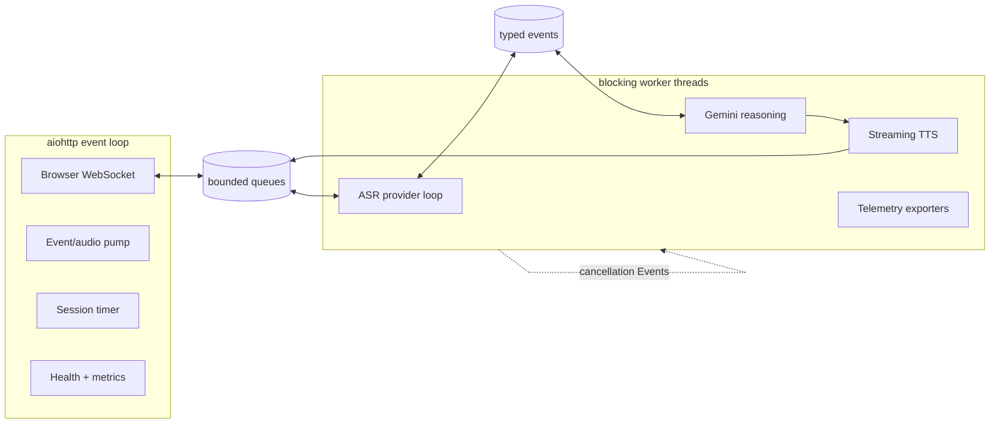

# Duet code walkthrough: Python and real-time control from first principles

Duet does **not** use FastAPI. The browser server uses `aiohttp`, Python threads and bounded `queue.Queue`
instances. That choice is visible in `web-demo/server.py`: `aiohttp` owns network I/O, while blocking model
SDKs run outside the event loop. This document teaches enough Python to defend that design and trace a turn.

## The Python vocabulary you need

| Construct | Meaning in this repository |
|---|---|
| `async def` / `await` | Cooperative network tasks; a task yields while waiting for WebSocket/provider I/O |
| `threading.Thread(..., daemon=True)` | Runs blocking ASR, TTS or Gemini work without freezing aiohttp |
| `queue.Queue(maxsize=N)` | Thread-safe handoff with explicit backpressure; a full audio queue drops work rather than growing forever |
| `threading.Event` | Cross-thread cancellation/state signal such as `cancel_speech` and `agent_speaking` |
| `dataclass` | Typed value object such as `Guidance`, `SpeechPreview` and `ActionRequest` |
| context manager / `with` | Acquires and always releases a resource; Gemini quota slots cannot leak on exceptions |
| generator / `yield` | TTS returns audio incrementally instead of waiting for a whole waveform |
| `try/finally` | Session cleanup runs even after disconnect, cancellation or exception |

The event loop must never execute a slow blocking API call. A blocking call inside `async def` freezes every
WebSocket task on that process. Duet therefore contains two concurrency worlds:



## Startup: configuration becomes runtime policy

Start at `main()` in `web-demo/server.py`:

1. `load_repo_env()` fills missing process environment values from the first repository `.env`.
2. `argparse` turns command-line flags and environment defaults into one `args` object.
3. incompatible combinations fail before serving—for example barge-in requires Sarvam streaming ASR.
4. `aiohttp.web.Application` stores immutable process configuration and session admission state.
5. routes are registered: `/ws`, `/healthz`, `/readyz`, `/metrics`, `/corrections`, `/`.
6. `web.run_app` owns the HTTP event loop.

Configuration is not validation of provider reachability. `/readyz` answers “are required secrets present?”;
the first real provider interaction answers “does this dependency currently work?”

## WebSocket admission and session ownership

`ws_handler()` executes before audio exists:

1. check the browser `Origin` against `ALLOWED_ORIGINS`;
2. derive the client IP, trusting `X-Forwarded-For` only when `TRUST_PROXY=true` behind Caddy;
3. enforce per-IP hourly/daily session limits;
4. reject if the one supported session slot is occupied;
5. construct `Session`, start worker threads and upgrade to a WebSocket;
6. run a pump task and independent server-side session timer;
7. accept fixed-size binary audio frames and small JSON control frames;
8. always stop workers and clear ownership in `finally`.

Why one active session? The current `active` owner and several provider connections are process-local. Rejecting
concurrency is honest load shedding. Pretending this state is multi-tenant would cause cross-call corruption.

## One turn, line by line conceptually

### 1. Browser audio

The AudioWorklet captures mono float32 PCM at 24 kHz. One frame contains 1,920 samples:

```text
1,920 samples / 24,000 samples per second = 0.080 seconds = 80 ms
1,920 × 4-byte float32 = 7,680 bytes per binary WebSocket frame
```

The browser supplies echo cancellation, noise suppression and gain control. These improve input but do not
solve speaker identity, loud background speech or telephone packet loss.

### 2. Streaming ASR and turn assembly

`Session._sarvam_brain_loop()` sends resampled 16 kHz PCM to Saaras and receives two independent signals:

- speech events say when acoustic activity starts/stops;
- partial transcript data says what the provider currently believes was spoken.

`TurnAssembler` merges fragments and commits only after endpoint/grace rules. A partial is provisional: later
audio may revise it. Duet may speculate on a sufficiently stable partial, but cannot speak that result until
the final transcript preserves the meaning.

### 3. Deterministic policy before probabilistic reasoning

`_accept_transcript()` handles controls that should not depend on an LLM: AI permission, opt-out, pause,
presence checks, backchannels and interruption repair. This prevents a creative model from negotiating around
“stop calling me” or interpreting noise as a new sales objection.

### 4. Gemini as planner, not controller

`ReasoningLayer.request()` allocates a monotonically increasing request ID and starts a daemon thread. The
thread enters `ProviderQuota.slot()` before any HTTP request. If RPM/RPD/concurrency is exhausted, it emits a
`ReasoningFailure` immediately; it does not wait on the conversation path.

The provider returns structured JSON. `parse_guidance()` validates every externally generated field against
allowlists: intent, strategy, stage, fact IDs, signals and tool request. Unknown labels become safe defaults;
missing required speech becomes failure.

Streaming Gemini output can expose a complete `talking_point` before metadata finishes. That preview can
prepare speech early, but request IDs and final policy still decide whether it remains current.

### 5. Grounding and action gates

`persona.py` owns static, source-labelled facts. Volatile price, inventory, offers and legal status are not
free-form model knowledge. `ActionLayer` translates allowlisted requests into either a local append-only
ledger or authenticated internal gateway calls, with idempotency keys and explicit requested/accepted/failed
states. Spoken confirmation must reflect the returned state.

### 6. Streaming TTS and cancellation

`tts.py` presents one interface: `synthesize_stream(text) -> Iterator[np.ndarray]`. The persistent Sarvam
WebSocket avoids a new handshake per utterance. Audio chunks enter `spk_q` and the aiohttp pump sends them to
the browser.

Barge-in has two phases:

1. provider speech-start grants the acoustic floor to the caller and cancels buffered playback;
2. transcript semantics decide whether this was opt-out, pause, correction, a new request, backchannel or
   ambiguous noise.

`cancel_speech`, queue clearing and generation IDs ensure old audio and late Gemini results cannot resurrect.

## Observability without changing the call

`LiveSessionTelemetry` creates one `session_id` and one Langfuse `trace_id`:

- `METRICS` updates lock-bounded in-memory Prometheus counters/histograms;
- JSON events enter a bounded queue and daemon writer, then Alloy sends the file to Loki;
- Langfuse batches trace events on a daemon exporter;
- Postgres writes one call summary after disconnect.

If these backends fail, the call continues. Dropped telemetry is itself measured. This is deliberate failure
containment, but persistent telemetry loss must page an operator in a real service.

## How to debug a bad conversation

Do not start by changing the prompt. Classify the failure at the earliest incorrect boundary:

| Symptom | First evidence to inspect |
|---|---|
| Wrong words on screen | ASR partial/final events and captured audio |
| Cut off mid-thought | speech event timing and `TurnAssembler` commit |
| Repeated irrelevant answer | request IDs, stale-result drops and conversation history |
| Talks through interruption | `playback_cancel` timestamp, browser queue drain and TTS generator close |
| Correct text, robotic sound | TTS chunk timing, underruns, pace/prosody and browser playout |
| False factual claim | fact IDs, source registry and capability/action result |
| Long silence | endpoint, Gemini TTFT, TTS TTFB and queue timing separately |

Then convert the real failure into the narrowest deterministic test or eval. That is what “evals are the new
PRDs” means here: the failed interaction becomes an executable statement of desired behavior.

## Five audience questions you should answer confidently

**Is this full duplex?** It is controlled/speculative duplex: listening stays live during speech and playback
is cancellable. The cloud cascade still uses explicit transcription and TTS; native Moshi is the research arm.

**Why not one speech-to-speech model?** Native models can improve timing and preserve paralinguistic cues, but
the cascade gives inspectable text, deterministic grounding, easy provider substitution and auditable actions.

**Why not parallelize everything?** Independent work overlaps, but causality remains. You cannot safely choose
an answer before sufficient caller intent or confirm an action before its system of record accepts it.

**Is 300 ms achieved?** Cancellation was 198 ms in the latest synthetic smoke; rich final-turn response was
2.169 s. Claiming a universal 300 ms conversational response would still be false.

**What makes it production-grade?** Not Docker. Per-call isolation, authentication, consent/DNC durability,
current tools, error budgets, fallbacks, load/reconnect/chaos tests, safe rollout and an operating team do.
